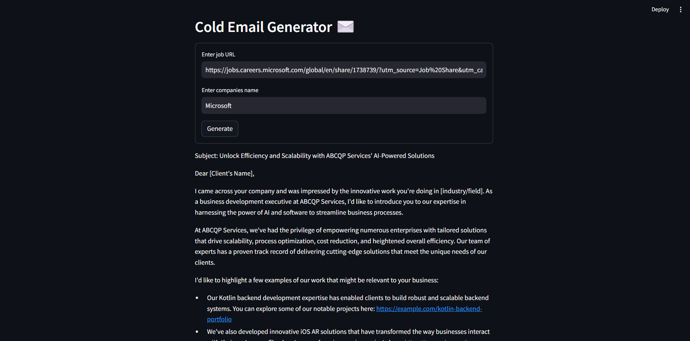
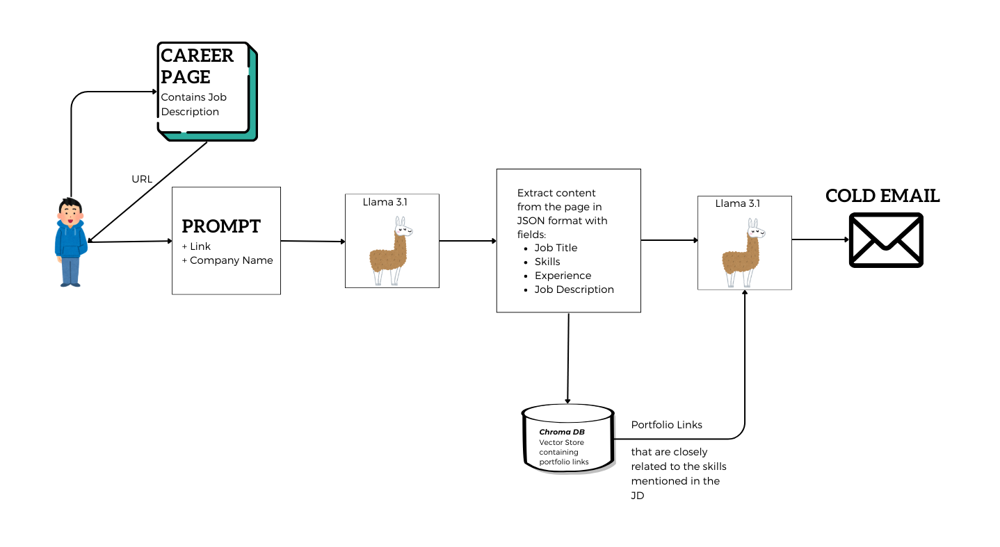

# Cold Email Generator :email:

This AI-powered tool is built using `groq`, `langchain`, `chromadb`, and `streamlit`. It’s designed specifically for service companies that want to generate personalized cold emails, helping them reach out to potential clients more effectively. These emails incorporate details from the company’s portfolio, developed using a basic `Retrieval-Augmented Generation (RAG) system`.

**Use Case:**  
A scenario where a well-established firm is seeking to hire a Machine Learning Engineer. A business development executive from a consulting firm can offer relevant services to the company. To effectively engage the hiring team, the executive generates a personalized cold email using this tool, showcasing the firm’s expertise and portfolio, tailored to the open position.

# Architecture

